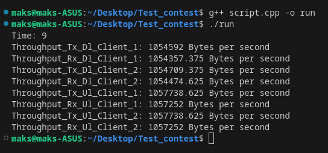

# Вакансия: Инженер-исследователь по разработке алгоритмов (AME)
## Карасев Максим
#### Версия NS: ns-allinone-3.41
#### Язык: C++

## Тестовое задание
<details><summary>Задание</summary>

**Основное задание**
* Установить NS-3 и скомпилировать.
* С помощью документации NS-3 сделать минимальный LTE сценарий:

    * Есть eNB и два абонента.
    * Траффик Full Buffer (пакеты идут в обе стороны бесконечно).
    * В LTE модуле сконфигурирован планировщик пакетов pf-ff-mac-scheduler.
    * В LTE модуле сконфигурирован вывод ключевых характеристик с Rlc и MAC уровня.
  
* Запустить сценарий и получить вывод ключевых характеристик.

**Основное задание**
Написать скрипт, который по полученному выводу ключевых характеристик с Rlc уровня 
посчитает Throughput в DL и в UL для каждого пользователя отдельно и выведет его на экран.

</details>

## Настройка NS-3
<details><summary> Установка NS-3</summary>
  
* Скачать архив: https://www.nsnam.org/releases/latest
* Распаковать архив в удобную вам папку.
```Shell
tar xjf ns-allinone-3.41.tar.bz2
```
* Перейти в место распаковки
```Shell
cd ns-allinone-3.41/ns-3.41
```

</details>

<details><summary>Компиляция NS-3</summary>
  
* Чтобы настроить ns-3 с включенными примерами и тестами,
запустите следующую команду в главном каталоге ns-3
```Shell
./ns3 configure --enable-examples --enable-tests
```
* Затем создайте ns-3, выполнив следующую команду:
```Shell
./ns3 build
```
</details>

## Использование кода
<details><summary>Пример использования кода</summary>

* Файл myCode вставить в ns-3.41/scratch
* В папке ns-3.41 в терминале ввести:

```Shell
./ns3 run myCode.cc
```

* После этого в папке ns-3.41 появятся следующие файлы:
    * DlMacStats.txt
    * DlPdcpStats.txt
    * DlRlcStats.txt
    * UlMacStats.txt
    * UlPdcpStats.txt
    * UlRlcStats.txt

* Для вывода Throughput из RLC уровня используем файл script.cpp
    * В коде меняем значение переменных DL_RLC и UL_RLC на путь до соответствующих текстовых файлов
    * Компилируем и запускаем файл:
    ```Shell
    g++ script.cpp -o run
    ./run
    ```


</details>

## Результат

* [MAC DL Stats](source/DlMacStats.txt)
* [MAC UL STATS](source/UlMacStats.txt)
* [RLC DL Stats](source/DlRlcStats.txt)
* [RLC UL Stats](source/UlRlcStats.txt)
* [PDCP DL Stats](source/DlPdcpStats.txt)
* [PDCP UL Stats](source/UlPdcpStats.txt)
* Throughput
